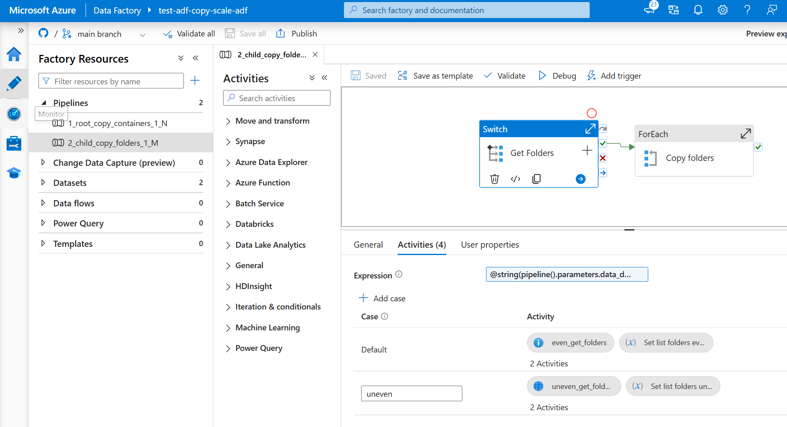
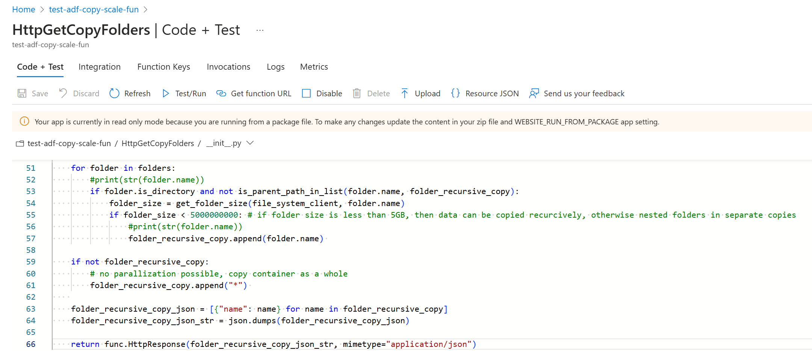

## Optimizing ADF Copy Performance for skewed Data Lakes
A common way to improve ADF performance is to parallelize copy activities. In this, the parallelization shall happen where most of the data is. For uniform distributed data, standard ADF functionality can be used. However, when data distribution is skewed, this can be challeging. In this project, an ADF parallelization project is deployed that can be used on uniform and skewed distributed data lakes.

### 1. Deploy Data Facory

Run the script ```deploy_adf.ps1 ``` In case ADF is succesfully deployed, there are two pipelines deployed:



In the switch, it can be seen that an Azure Function is used when the parameter is set for an uneven distributed data lake. This Azure Function is deployed in the next step.

### 2. Deploy Azure Function

Run the following commands:

Run the script ```deploy_azurefunction.ps1 ``` In case ADF is successfully deployed, there are two pipelines deployed:



### 3. Project overview

After the project is deployed, it can be noticed that the following tooling is deployed to improve copy performance:
- Root pipeline: Root pipeline on that lists containers N on storage account and triggers child pipeline for each container
- Child pipeline: Child pipeline on that lists folders M in container and triggers recursive copy activity for each folder
- Switch: Child pipeline uses a switch to decide how list folders shall be determined. For case "default" (even), Get Metadata is used, for case "uneven" an Azure Function is used
- Get Metadata: List all root folders M in a given container N
- Azure Function: List all folders and sub folders that contain no more than X GB of data and shall be copied as a whole
- Copy activity: Recursively copy for all data from a given folder

### 4. Strategy

A distinction is made between uniform distributed data and skewed distributed data.

- Uniform Distributed Data: In case it is known on beforehand that data is evenly distributed, ADF standard functionality can be used to parallelize copy activities on each container N and root folder M. To use this strategy, Switch "even" or "default" shall be used.
  - Advantage is that solution is easy to setup and requires no coding. 
  - Disadvantage is that it requires the assumption that data is evenly distributed.

- Skewed Distributed Data: For data distributions where some folders contain significantly more data, incorporating Azure Functions to dynamically identify and parallelize copy activities in data-heavy folders is essential. This strategy ensures that copy activities are focused where they are needed most, improving overall throughput and making the process more efficient. To use this strategy, Switch "uneven" shall be used.
  - Advantage is that solution is flexible and can be used for any data lake.
  - Disadvantage is that it requires coding and is more complex

In short: In case data is known to be evenly distributed in data lake, it is recommended to go for the standard solution. However, when data is really skewed, it is recommended to use an Azure Function since this can be used to determine where the "pockets of data" are, return folder list to Data Factory that can then parallelize copy pipelines per folder.